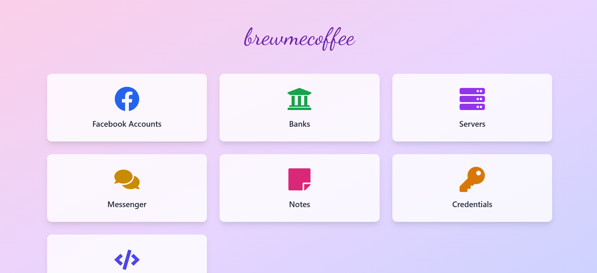

# BrewMeCoffee - Personal Account Manager 🔒

A secure, modern web application for managing all your digital accounts, passwords, and credentials in one place. Built with Next.js and Prisma.



## 🌟 Features

- **Secure Credential Management**

  - Store and manage account credentials with end-to-end encryption
  - Support for custom fields and metadata
  - Export functionality with encrypted data
  - One-click copy for quick access

- **Facebook Account Management**

  - Manage multiple Facebook accounts
  - Store 2FA secrets and generate codes
  - Email and password management
  - Custom tagging system

- **Bank Account Management**

  - Secure storage of bank account details
  - Support for multiple banking credentials
  - UPI and net banking information
  - IFSC and SWIFT code management

- **Server Management**

  - Store server credentials and IPs
  - Root password management
  - Custom field support for server metadata
  - Bulk export functionality

- **Messenger & Notes**

  - Built-in messaging system with media support
  - Note-taking with markdown support
  - Pin important notes
  - Export functionality

- **Code Snippets**
  - Store and organize code snippets
  - Syntax highlighting for multiple languages
  - Easy copy and export features
  - Search and filter capabilities

## 🚀 Getting Started

### Prerequisites

- Node.js 18+
- SQLite (or any database supported by Prisma)
- NPM or Yarn

### Installation

1. Clone the repository:

```bash
git clone https://github.com/brewmecoffee/brewmecoffee.git
cd brewmecoffee
```

2. Install dependencies:

```bash
npm install
```

3. Set up your environment variables:

```bash
cp .env.example .env
```

Edit `.env` file with your configuration:

```env
DATABASE_PATH="file:./brewmecoffee.db"
NEXT_PUBLIC_ENCRYPTION_KEY="your-32-char-encryption-key"
```

4. Initialize the database:

```bash
npx prisma generate
npx prisma db push
```

5. Start the development server:

```bash
npm run dev
```

Visit `http://localhost:3000` to access the application.

## 🔧 Technology Stack

- **Frontend**

  - React 18
  - Next.js 14
  - Tailwind CSS
  - React Icons

- **Backend**

  - Next.js API Routes
  - Prisma ORM
  - SQLite Database

- **Security**

  - CryptoJS for encryption
  - OTPLib for 2FA
  - Secure password management

- **Development**
  - ESLint
  - Prettier
  - TypeScript support

## 📂 Project Structure

```
brewmecoffee/
├── app/                 # Next.js app directory
│   ├── api/            # API routes
│   ├── banks/          # Bank accounts feature
│   ├── credentials/    # Credentials feature
│   ├── facebook-accounts/
│   ├── messenger/
│   ├── notes/
│   ├── servers/
│   └── snippets/
├── components/         # React components
├── prisma/            # Database schema
├── public/            # Static files
└── utils/             # Utility functions
```

## 🔐 Security Features

- End-to-end encryption for sensitive data
- Secure password storage
- Environment variable management
- XSS protection
- CSRF protection
- Rate limiting
- Input sanitization

## 🛠️ Development

### Available Scripts

- `npm run dev` - Start development server
- `npm run build` - Build for production
- `npm start` - Start production server
- `npm run lint` - Run ESLint
- `npm run format` - Format code with Prettier

### Database Management

- `npx prisma studio` - Open Prisma Studio
- `npx prisma generate` - Generate Prisma Client
- `npx prisma db push` - Push schema changes

## 🔄 Updates & Maintenance

1. Pull the latest changes:

```bash
git pull origin main
```

2. Install any new dependencies:

```bash
npm install
```

3. Update database schema:

```bash
npx prisma generate
npx prisma db push
```

## 📝 Contributing

1. Fork the repository
2. Create a feature branch
3. Commit your changes
4. Push to the branch
5. Create a Pull Request

## 🪲 Bug Reports

If you find a bug, please create an issue with:

- Detailed description of the bug
- Steps to reproduce
- Expected behavior
- Screenshots (if applicable)

## 📄 License

MIT License. See [LICENSE](LICENSE) for more information.

## 👨‍💻 Author

**Devashish Sharma**  
Contact: devashish0571@gmail.com

## 🙏 Acknowledgments

- Next.js Team
- Prisma Team
- All contributors and supporters

---

Made with ❤️ and ☕ by Devashish Sharma
